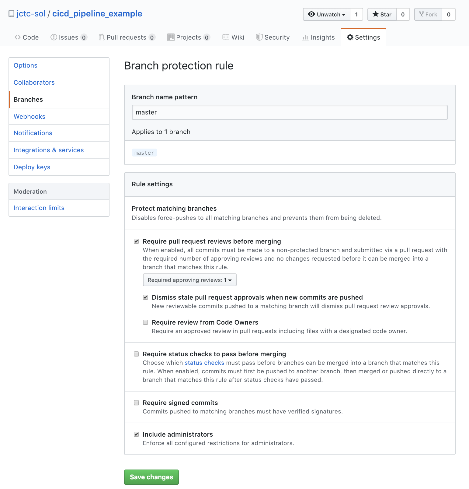

# cicd_pipeline_example

The goal here is to demonstrate how to set up a CI/CD pipeline with a cloud native builder.

## 1. Setup GitHub Repository

### 1.1 Create a new repository
Login into your GitHub account and create a new repository. Once created, following the instruction given to you in GitHub, which looks something like the following (note: to be executed locally in your terminal, under your chosen project directory):

```
echo "# cicd_pipeline_example" >> README.md
git init
git add README.md
git commit -m "first commit"
git remote add origin https://github.com/jctc-sol/cicd_pipeline_example.git
git push -u origin master
```

This will initialize the directory as a local git-tracked repository, track README.md document, make the first commit, add a remote origin (which points to the GitHub repository, not your local repository), and push the changes to the remote repositorys' master branch.

### 1.2 Create Dev/Staging branches
Next, we will create two branches: dev & staging. This way there would be three branches: master, staging, and dev
- **dev**: use for development purpose, code can be pushed freely to this branch as one works on developing their code
- **staging**: represents the intermediate staging zone for additional QA and testings; code cannot be pushed freely to this branch, instead *merging* code from dev to staging should be done via a *pull request*
- **master**: represents the production state (i.e. code that is deployed in production environment); code cannot be pushed freely to this branch, but only through a *pull request* from the staging branch

In your local terminal, use the following code to set up additional branches and sync to remote GitHub repository:

```
git checkout -b <BRANCH_NAME>
git push origin <BRNACH_NAME>
```

### 1.3 Setup Branch Protections
With multple branches created, we will want to protect our master and staging branches against code pushes without pull requests. You can turn on these protections for your repository by going to the *Settings* tab on the top and select *Branches* on the left hand selection list as illustrated below:



We will create branch protection rules for both the master and staging branches by checking off the ***Require pull request reviews before merging*** plus ***Dismiss stale pull request approvals when new commits are pushed***. Furthermore, we will enforce these rules also upon the administrators. 

(A nice protection to also include might be the ***Require review from Code Owners*** options, which you can read more here: https://help.github.com/en/articles/about-code-owners)

In additional, we will also check off ***Require status checks to pass before merging*** and its sub-checkbox ***Require branches to be up to date before merging***. More details about these status checks later, which will be provided by external build services that will be setup later.
