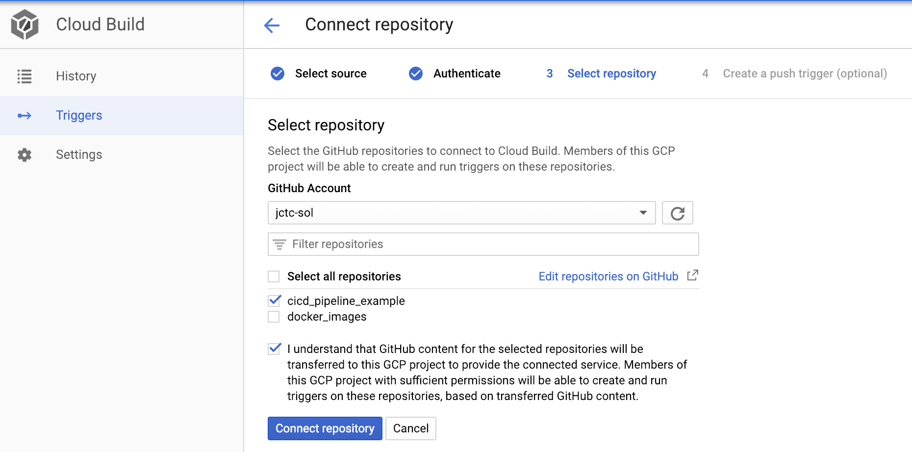

# cicd_pipeline_example

The goal here is to demonstrate how to set up a CI/CD pipeline with a cloud native builder.

## 1. Setup GitHub Repository

### 1.1 Create a new repository
Login into your GitHub account and create a new repository. Once created, following the instruction given to you in GitHub, which looks something like the following (note: to be executed locally in your terminal, under your chosen project directory):

```
echo "# cicd_pipeline_example" >> README.md
git init
git add README.md
git commit -m "first commit"
git remote add origin https://github.com/jctc-sol/cicd_pipeline_example.git
git push -u origin master
```

This will initialize the directory as a local git-tracked repository, track README.md document, make the first commit, add a remote origin (which points to the GitHub repository, not your local repository), and push the changes to the remote repositorys' master branch.

### 1.2 Create Dev/Staging branches
Next, we will create two branches: dev & staging. This way there would be three branches: master, staging, and dev
- **dev**: use for development purpose, code can be pushed freely to this branch as one works on developing their code
- **staging**: represents the intermediate staging zone for additional QA and testings; code cannot be pushed freely to this branch, instead *merging* code from dev to staging should be done via a *pull request*
- **master**: represents the production state (i.e. code that is deployed in production environment); code cannot be pushed freely to this branch, but only through a *pull request* from the staging branch

In your local terminal, use the following code to set up additional branches and sync to remote GitHub repository:

```
git checkout -b <BRANCH_NAME>
git push origin <BRNACH_NAME>
```

### 1.3 Setup Branch Protections
With multple branches created, we will want to protect our master and staging branches against code pushes without pull requests. You can turn on these protections for your repository by going to the *Settings* tab on the top and select *Branches* on the left hand selection list as illustrated below:


We will create branch protection rules for both the master and staging branches. We will also check off ***Require status checks to pass before merging*** and its sub-checkbox ***Require branches to be up to date before merging***. You likely won't have any status checks in place yet (as shown by the *mldevops-Python package-CI* checkbox in the above screenshot). More details about these status checks later, we will leverage external build services that will in later section.

(Note: If you are working in a team environment, it is a good idea to check off the ***Require pull request reviews before merging*** plus ***Dismiss stale pull request approvals when new commits are pushed***. This provides a mechanism to enforce peer code review process. A nice protection to also include might be the ***Require review from Code Owners*** options, which you can read more here: https://help.github.com/en/articles/about-code-owners)


## 2. Setup Continuous Integration (CI) Pipeline

The purpose of the CI pipeline is to ensure that any net-new changes to the code base does not break the existing code base. This is typically enforced by a series of unit tests conducted on the code. In this section, we will leverage cloud services to create CI pipeline to automates this testing process. More specifically we will configure our repository to trigger the CI pipeline everytime there is a new pull request created, attempting to merge code from the *dev* branch to *staging* branch.

### 2.1 Setting up CI Pipeline in Azure

...


### 2.2 Setting up CI Pipeline in Google Cloud Platform (GCP)

#### Connecting repository to Cloud Build
A GCP account and project needs to be created first. In GCP console, navigate to ***Cloud Build*** interface. First, you will need to connect your repository to Cloud Build by allowing it access. Click on the *Connect repository* button on the top and you will see option to connect either a Github or Bitbucket repository.

You might be prompted to install Cloud Build to your Github repository. A window will pop-up and ask for your Github login, enter your credential to grant Cloud Build access to your repository. Afterwards, you will see list of repositories under your Github account show up on the Cloud Build interface. Select the repository you want to connect to and click *Connect repository*.



#### Creating triggers
Once you see your repository is connected with Cloud Build, you can then create *trigger(s)*. Click on the three dots icon on the right of your listed repository and select *Add trigger*. 

In the following menu, you will need to configure your trigger such that Cloud Build will get triggered when specific actions are done to the repository branch(es). The figure below provides the basic setting for Cloud Build to trigger based on a pull request made to the staging branch of the repository. Note that the *Cloud Build Configuration file (yaml or json)* option has been selected and that Cloud Build will expect the build configuration to be located in the root directory of the repository, named *cloudbuild.yaml*.


#### Creating a configuration yaml file
The *cloudbuild.yaml* file ...
